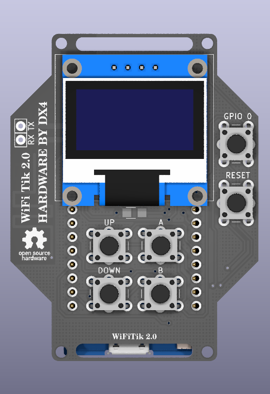

# WiFiTik Prototype
This project used base firmware [WiFi Tools](https://github.com/dx4grey/esp8266_wifitools)

## Component quantity

| Designator     | Quantity | Value                             | Pack                                | MPN                                | Mount Type |
| -------------- | -------- | --------------------------------- | ----------------------------------- | ---------------------------------- | ---------- |
| 1              | 1        | OLED                              |                                     |                                    | THT        |
| D1 MINI        | 1        | Wemos-D1-mini                     | wemos-d1-mini-connectors-only       |                                    | THT        |
| A, B, DOWN, UP | 4        | SW_PUSH_6mm                       | SW_PUSH_6mm                         |                                    | THT        |
| Hole, Hole, Hole, Hole | 4 | MountingHole_2.1mm              | MountingHole_2.1mm                  |                                    | THT        |
| LED            | 1        | LED_Cree-XQ_HandSoldering         | LED_Cree-XQ_HandSoldering           |                                    | SMT        |
| R1, R2         | 2        | Resistor                          | Resistor                            |                                    | THT        |
| RX, TX         | 2        | Pin_D0.9mm_L10.0mm_W2.4mm_FlatFork | Pin_D0.9mm_L10.0mm_W2.4mm_FlatFork |                                    | THT        |
| VIN            | 1        | Power 5V                           | Power 5V                            |                                    | SMT        |

## PCB Previews

  
Front View

  

  
Back View

  
  

## About this Project

This firmware allows you to easily perform a variety of actions to test 802.11 networks using an [ESP8266](https://www.espressif.com/en/products/socs/esp8266). It's also a great project for learning about WiFi, microcontrollers, Arduino, hacking and electronics/programming in general.  

The deauthentication attack is the main feature, which can be used to disconnect devices from their WiFi network.  
Although this denial-of-service attack is nothing new, a lot of devices are still vulnerable to it. Luckily this is slowly changing with more WiFi 6 enabled devices being used. But a lot of outdated WiFi devices remain in place, for example in cheap IoT hardware.
With an ESP8266 Deauther, you can easily test this attack on your 2.4GHz WiFi network/devices and see whether it's successful or not. And if it is, you know you should upgrade your network.

## Disclaimer

This project is a proof of concept for testing and educational purposes.  
Neither the ESP8266, nor its SDK was meant or built for such purposes. **Bugs can occur!**  

**Use it only against your own networks and devices!**  
Please check the legal regulations in your country before using it.  
We don't take any responsibility for what you do with this program.  